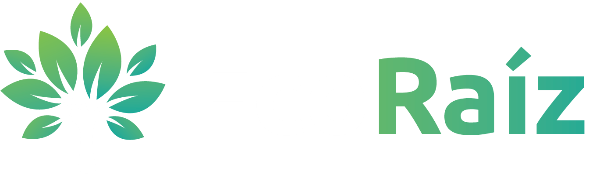

  

  

<h1 align="center">
¡Hola, somos EcoRaíz Argentina!
	
</h1>

 

## <picture></picture> Sobre Nosotros

   <strong>EcoRaíz</strong> es una plataforma web dedicada a promover la conciencia ecológica, la educación ambiental y la preservación de la biodiversidad. El sitio ofrece información detallada sobre programas de conservación, talleres educativos y un canal directo de contacto para la comunidad interesada en el cuidado del medio ambiente.

 

## <picture></picture> Características y Secciones 

El proyecto está compuesto por una estructura de páginas interconectadas y un diseño moderno, responsivo y dinámico:

* **Inicio (`index.html`):** Presentación principal con un Hero dinámico, introducción a la misión de la organización y acceso rápido a las novedades.
* **Nosotros (`nosotros.html`):** Información sobre el equipo, los valores, historia y la visión a largo plazo de EcoRaíz.
* **Programas (`programas.html`):** Detalle e información sobre proyectos de energías limpias.
    * *Educación Ambiental (`Educacion-ambiental-programa.html`):* Detalle de los talleres, cursos y charlas para la comunidad.
    * *Conservación de Ecosistemas (`conservacion-ecosistema-programa.html`):* Información sobre proyectos de campo y preservación de flora y fauna.
* **Contactos (`contactos.html`):** Formulario integrado para consultas, sugerencias o inscripciones a los programas.

 

## <picture></picture> Características y Secciones 

* **Paleta de Colores:** Inspirada en la naturaleza, utilizando una combinación armónica de verdes profundos y un toque de azul cian brillante para destacar elementos interactivos.
* **Experiencia de Usuario (UX):** Animaciones suaves al hacer scroll, efectos dinámicos de *hover* en tarjetas de programas y menús completamente adaptados a dispositivos móviles (Mobile-First).

 

<!--Habilidades y herramientas-->

## <picture></picture> Herramientas utilizadas

 
  
 : Estructuración semántica de todo sitio.

 
  
 : Diseño personalizado, maquetación adaptativa mediante <strong>Flexbox</strong> / <strong>Grid Layout</strong>, animaciones fluidas y efectos visuales avanzados (como sombras gradientes y transiciones).

    
 : Interactividad del sitio, manejo del menú responsivo, animaciones dinámicas (mediante librerías de scroll) y validación del lado del cliente.

 

## <picture></picture> Integrantes

* **Kevin Sanchez**
* **Migueles Cristian**
* **Eric Rodriguez Ferreyra**
* **Enrique Matias Gabriel**